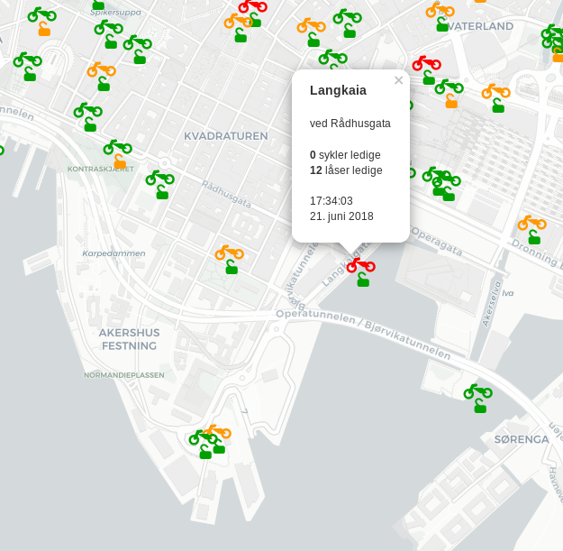

# demo-livedata-citybike-Oslo
Displaying live citybike data by pulling geojson every N second. Javascript: Leaflet, realtime. Super-simple python backend  

# Frontend - map

Bike stations are shown as bike and locks symbols. Orange means 3 or fewer bikes or locks, red = none, and green > 3 available.

[Leaflet](https://leafletjs.com/) Javascript map client augmented with [leaflet-realtime](https://github.com/perliedman/leaflet-realtime) for updating the data every N second. (N = 20 seconds in current implementation). This is done by http get to a geojson file which resides at our backend.

# Backend

Backend can be any web server capable of updating and publishing the appropriate geojson-file with appropriate CORS permissions (or circimventing the problem by adding the http header `accept-origin:*`, no matter what). Or serve this geojson-file from the same web server as the map frontend, and you'll be _same origin_, avoiding the need for CORS (cross origin).

I've played with two different backends:  
  * A super-simple python script run regulary at [pythonanywhere](https://pythonanywhere.com)
  * Flows in [node-red](https://nodered.org) run at a cloud linux machine. 
  
## Backend no 1: Flows in node-red (Trondheim and Oslo)

https://nodered.org/ is fantastic for this kind of thing. My flows for pulling bicycle data from Trondheim and Oslo are included in the repos. They are very far from optimal and elegant, but considering this is my very first node-red project I'm not too picky. 

The process is as follows: 
  * Pull location data (lat, lon) and names of city stations once each hour, put them in local mongodb
  * Pull city bike station updates every 10th second, merge with station data from local mongodb, dump geojson

## Backend no 2: Python script for Oslo citybike data 

This was the quickest solution I could whip up at short notice. Web server is python flask app run at pythonanywhere, but can run on any machine with python >= 3.4 able to serve files on internet with appropriate. The script pulls two data sets from __Oslo bysykkel__, puts the data in pandas dataframes and merges them on common ID. This dataframe becomes a *Geodataframe* [geopandas](http://geopandas.org/), which is then dumped to geojson. 

The disadvantage of using generic dataframes / geodataframes is that they are resource intensive, so Pythonanywhere.com keeps nagging me with __your processes are in the tar pit__. The problem is essentially merging two datastructures (list and dicts), and write out a geojson. Just hardcoding that in plain python isn't exactly difficult, and will probably be far less resource-intensive. But if you're familiar with pandas and geodataframes, my solution was quickest to write... 

### Pulling data from oslobysykkel.no

The script `pythonbackend/bysykkeloslo.py` runs an infinite loop fetching data from https://developer.oslobysykkel.no/ . We have a merge process, where presumably static data with station locations (pulled once) are merged with fresh status updates (pulled every 15th second).

I have implemented the tips from https://help.pythonanywhere.com/pages/LongRunningTasks/ to keep the process running smoothly. Only one instance of this script can run at any time. Every hour we try to start a new process. If one process is running we let it be, if not we start a new one.

If _(or rather when, see next paragrahp)_ the script crashes the data won't be updated before the next time we restart the script. Worst case is data will be close to an hour old before we've restarted. Of course, that's assuming valid data actually are available from the API.

### Production hardening

There is absolutely NO input validation. The process WILL CRASH if the next REST GET operation does not go through or return incomplete data. Battle hardening with appropriate tests is straightforward, but left as exercise to the reader.

Another (easier) option is to delete the while-loop and just run the script once every N second.

### Debugging

The script `debug_bysykkeloslo.py` will read the specific geojson-file, modify the number of available locks and bicycles and write back again. Infinite while-loop, process is repeated every 17th second.
